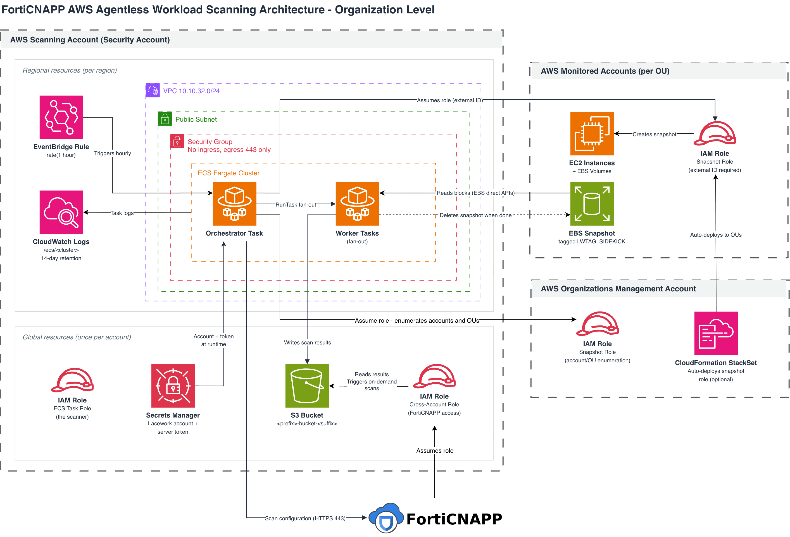

# Lacework AWS Agentless Workload Scanning

## Overview

This integration gives Lacework vulnerability and container visibility into your EC2 workloads without installing an agent on any host. Instead of running software inside your instances, Lacework deploys a scanner into a single AWS account you control. That scanner takes EBS snapshots of your instances, analyzes the snapshot data out-of-band, writes findings to an S3 bucket, and deletes the snapshots. Your workloads are never modified, restarted, or logged into.

The deployment spans up to three kinds of AWS account:

- **Scanning account** (sometimes called the security account) — hosts all scanning infrastructure: the S3 results bucket, the ECS Fargate cluster that runs the scanner, and the IAM roles.
- **Monitored accounts** — every account whose workloads you want scanned. Each receives exactly one IAM role that allows the scanner to create and read snapshots. Nothing else is deployed.
- **AWS Organizations management account** — receives the same snapshot role, which the scanner uses to enumerate the accounts and OUs it should scan.

For a single-account deployment, all three collapse into one account.

---

## Architecture

The module is deployed multiple times with different flags rather than once with a large configuration. Understanding these three switches is the key to reading any of the examples:

| Flag | Deployed once per | What it creates |
|---|---|---|
| `global = true` | scanning account | S3 results bucket, Secrets Manager secret, the IAM roles, and the Lacework cloud account integration |
| `regional = true` | scanning account, per region | VPC, subnet, security group, ECS Fargate cluster, task definition, EventBridge trigger, CloudWatch log group |
| `snapshot_role = true` | each monitored account and the management account | one assumable snapshot role |



The `global_module_reference` input is how these instantiations are wired together. The global module exposes its `prefix`, `suffix`, `external_id`, IAM role ARNs, secret ARN, and bucket ARN as outputs; every regional and snapshot-role instantiation takes that output as a single input:

```hcl
module "lacework_aws_agentless_scanning_region_usw2" {
  regional                = true
  global_module_reference = module.lacework_aws_agentless_scanning_global
}
```

This matters more than it appears. Resource names are built as `{prefix}-{thing}-{suffix}`, and the IAM policies restrict actions to those exact ARNs — the ECS cluster the scanner may run tasks in, the EventBridge rule it may enable and disable, the roles it may pass. If a regional or snapshot-role instantiation generates its own random suffix instead of inheriting the global one, the names diverge and the scanner is denied access to its own infrastructure. Always pass `global_module_reference`.

---

## How the Integration Is Established

When the module is applied, the following happens.

### 1. Lacework Integration and External ID

A `lacework_external_id` resource generates a v2 external ID scoped to the scanning account. Then one of two integration resources is created in the Lacework platform:

- `lacework_integration_aws_agentless_scanning` for a single-account deployment.
- `lacework_integration_aws_org_agentless_scanning` when `organization.monitored_accounts` is non-empty.

Either way, the integration returns a `server_token` that the scanner uses to authenticate back to Lacework.

### 2. Results Bucket

A private S3 bucket named `{prefix}-bucket-{suffix}` holds scan working data and results. All four public access blocks are enabled. Server-side encryption is on by default (`AES256`; set `bucket_sse_algorithm = "aws:kms"` with `bucket_sse_key_arn` to use a KMS key instead). The bucket policy denies any request that is not over TLS, and denies `PutObject` calls that do not specify server-side encryption.

Lifecycle rules keep the data short-lived: objects under `sidekick/work/` expire after 7 days, and everything under `sidekick/` expires after 30 days.

### 3. Scanner Credentials

An AWS Secrets Manager secret named `{prefix}-secret-{suffix}` stores the Lacework account name and the integration's server token as JSON. The scanner receives only the secret's ARN as an environment variable (`SECRET_ARN`) and fetches the value at runtime — the token never appears in a task definition, a container environment variable, or a CloudFormation parameter. Set `secretsmanager_kms_key_id` to encrypt the secret with a customer-managed key.

### 4. IAM Roles in the Scanning Account

Four roles are created:

| Role | Trusted by | Purpose |
|---|---|---|
| `{prefix}-task-role-{suffix}` | `ecs-tasks.amazonaws.com` | The scanner's own identity. Creates snapshots, assumes snapshot roles in target accounts, launches worker tasks, writes to the bucket. 12-hour maximum session. |
| `{prefix}-task-execution-role-{suffix}` | `ecs-tasks.amazonaws.com` | Fargate infrastructure role — pulls the container image and creates log streams. |
| `{prefix}-task-event-role-{suffix}` | `events.amazonaws.com` | Lets EventBridge call `RunTask` on the cluster. Uses the AWS-managed `AmazonEC2ContainerServiceEventsRole`. |
| `{prefix}-cross-account-role-{suffix}` | Lacework's AWS account | Lets the Lacework platform read results from the bucket and trigger on-demand scans. |

Each role has a corresponding `use_existing_*` flag if your organization requires roles to be created by a separate process. Roles the scanner interacts with are tagged `LWTAG_SIDEKICK = 1`, which is load-bearing — see [Security Design](#security-design).

### 5. Regional Scanning Network

Each region gets an isolated network for the scanner:

- A dedicated VPC at `vpc_cidr_block` (default `10.10.32.0/24`) with a single subnet, an internet gateway, and a default route.
- A security group with **no ingress rules at all** and egress restricted to TCP 443. The scanner only ever makes outbound HTTPS calls.
- A restrictive default network ACL and an emptied default security group.
- VPC flow logs capturing `REJECT` traffic only, delivered to `sidekick/flow-logs/` in the results bucket (disable with `use_aws_flow_log = false`).

If you already have networking you want to use, `use_existing_vpc`, `use_existing_subnet`, and `use_existing_security_group` let you supply it. `use_internet_gateway = false` is for environments that route egress through something other than an internet gateway.

### 6. Regional Compute

An ECS cluster named `{prefix}-cluster-{suffix}` is created with both the `FARGATE` and `FARGATE_SPOT` capacity providers. Its task definition requests 4 vCPU and 8 GB of memory, uses `awsvpc` networking, and runs the Lacework scanner image (`public.ecr.aws/p5r4i7k7/sidekick:latest` by default, overridable via `image_url`). The container adds the `SYS_PTRACE` Linux capability, which it needs to inspect processes and binaries found on mounted snapshot data.

Container logs go to the `/ecs/{prefix}-cluster-{suffix}` CloudWatch log group with 14-day retention. This is the first place to look when troubleshooting.

### 7. Scan Trigger

An EventBridge rule named `{prefix}-periodic-trigger-{suffix}` fires on `rate(1 hour)` and launches one Fargate task with `STARTUP_SERVICE=ORCHESTRATE`.

**The hourly rule is not your scan frequency.** The actual cadence is `scan_frequency_hours` (6, 12, or 24), which is configured on the Lacework integration, not in AWS. The rule wakes an orchestrator hourly; the orchestrator decides whether scanning work is due and acts accordingly. This is also why the task role is permitted to call `events:DisableRule` and `events:EnableRule` — but only against that one rule's ARN. The scanner manages its own trigger while a scan is in flight.

### 8. Snapshot Roles in Target Accounts

Each monitored account, and the management account, gets a role named `{prefix}-snapshot-role-{suffix}`. Its trust policy names exactly one principal — the scanning account's task role ARN — and requires the shared external ID. Nothing else can assume it.

---

## How a Scan Runs

1. The EventBridge rule fires and Fargate starts an orchestrator task in the scanning account's cluster.
2. The task reads the Secrets Manager secret and authenticates to `{lacework_account}.{lacework_domain}` to retrieve its scan configuration.
3. In an organization deployment, it assumes the snapshot role in the **management account** and calls `organizations:List*` to expand the OUs and root IDs in `monitored_accounts` into a concrete list of AWS account IDs.
4. For each target account, it assumes that account's snapshot role, presenting the external ID.
5. It calls `ec2:Describe*` to find in-scope instances and volumes, then `ec2:CreateSnapshot`, tagging each new snapshot with `LWTAG_SIDEKICK`.
6. It reads snapshot contents through the EBS direct APIs (`ebs:ListSnapshotBlocks`, `ebs:GetSnapshotBlock`) rather than attaching volumes to an instance — no EC2 instance is ever launched, and the source volume is never touched.
7. It fans work out to additional Fargate tasks in the same cluster via `ecs:RunTask`, passing the scanner roles (`iam:PassRole`, restricted to roles tagged `LWTAG_SIDEKICK`).
8. Findings are written under `sidekick/` in the results bucket.
9. Snapshots are deleted (`ec2:DeleteSnapshot`, permitted only on resources tagged `LWTAG_SIDEKICK`).
10. Lacework assumes the cross-account role and reads the results from the bucket.

What gets scanned is shaped by `scan_containers`, `scan_host_vulnerabilities`, `scan_stopped_instances`, and `scan_multi_volume` (secondary volumes, off by default). To narrow the target set further, `filter_query_text` accepts an LQL query — see [Limit Scanned Workloads](https://docs.lacework.net/onboarding/lacework-console-agentless-workload-scanning#aws---limit-scanned-workloads).

---

## How Lacework Accesses Your Account

There are two distinct trust paths, and they do different things. Neither grants access to your running workloads.

### Path 1: The Lacework Platform to the Scanning Account

The cross-account role (`{prefix}-cross-account-role-{suffix}`, or a name you choose via `cross_account_role_name`) is assumable only by `arn:aws:iam::434813966438:role/lacework-platform`, and only when the correct external ID is presented. It grants:

| Permission set | Scope |
|---|---|
| `s3:ListBucket`, `s3:GetBucketLocation`, `s3:GetBucketTagging`, `s3:PutBucketTagging` | the results bucket only |
| `s3:GetObject`, `s3:PutObject`, `s3:DeleteObject` | objects inside that bucket only |
| `ecs:RunTask`, `ecs:StopTask` | the scanning cluster only — this is how an on-demand scan from the Lacework Console starts a task |
| `iam:PassRole` | the scanner task role and execution role only |
| `ec2:DescribeSubnets` | subnets tagged `LWTAG_SIDEKICK` |

That is the full extent of Lacework's access into your AWS environment. It cannot read your EC2 instances, your other buckets, or your IAM configuration.

### Path 2: The Scanner to Monitored Accounts

The scanner's task role assumes each account's snapshot role. That role's permissions are:

- `ec2:Describe*` — read-only discovery of instances and volumes.
- `ec2:CreateSnapshot` and `ec2:CreateTags` (the latter only as part of a `CreateSnapshot` action).
- `ec2:DeleteSnapshot`, `ec2:ModifySnapshotAttribute`, `ec2:ResetSnapshotAttribute`, and the EBS direct read APIs — **all conditioned on the resource carrying the `LWTAG_SIDEKICK` tag**, so the scanner can only act on snapshots it created.
- KMS `Decrypt`, `Encrypt`, `GenerateDataKey*`, and `CreateGrant` — conditioned on `kms:ViaService = ec2.*.amazonaws.com`, so these keys can be used for snapshot operations and nothing else. This is what allows encrypted volumes to be scanned.
- `organizations:Describe*` and `organizations:List*` — used only in the management account, for account enumeration.

There is no permission to start, stop, modify, or connect to an instance, and no permission to read data from anywhere other than a snapshot the scanner itself created.

### The External ID

The external ID is generated once by the Lacework provider, scoped to the scanning account, and shared to every other module instantiation through `global_module_reference`. It is required by both trust policies above — the Lacework platform must present it to assume the cross-account role, and the scanner must present it to assume a snapshot role.

This protects against [confused-deputy attacks](https://docs.aws.amazon.com/IAM/latest/UserGuide/confused-deputy.html), where a third party could otherwise trick Lacework into accessing an account that is not theirs. Because the external ID is unique to your deployment, no other Lacework customer's integration can assume your roles.

---

## Multi-Account and Organization Deployments

Set the `organization` input on the global module to scan beyond the scanning account:

```hcl
global = true
organization = {
  // Account IDs, OU IDs (ou-*), or the organization root (r-*).
  monitored_accounts = ["123456789012", "ou-abcd-12345678"]
  // Must be the AWS Organizations management account.
  management_account = "000123456789"
}
```

Setting this switches the module to the organization integration resource and requires `global = true` (the module fails validation otherwise). The management account **must** also have the snapshot role installed — without it the scanner cannot expand OUs into account IDs, and accounts listed only by OU will silently go unscanned.

### Installing the Snapshot Role

There are two approaches.

**Explicit, per account.** Add one `snapshot_role = true` instantiation of this module per account, each with its own AWS provider alias. See [examples/multi-account-multi-region](../examples/multi-account-multi-region). This is straightforward but requires a Terraform change whenever an account joins.

**Automatic, via StackSet.** Deploy a CloudFormation StackSet in the management account with `permission_model = "SERVICE_MANAGED"` and `auto_deployment` enabled, using Lacework's published `snapshot-role.json` template. Its parameters — `ExternalId`, `ECSTaskRoleArn`, `ResourceNamePrefix`, `ResourceNameSuffix` — come directly from the global module's outputs, which is what keeps role names consistent with the scanning account's IAM conditions:

```hcl
parameters = {
  ExternalId         = module.lacework_aws_agentless_scanning_global.external_id
  ECSTaskRoleArn     = module.lacework_aws_agentless_scanning_global.agentless_scan_ecs_task_role_arn
  ResourceNamePrefix = module.lacework_aws_agentless_scanning_global.prefix
  ResourceNameSuffix = module.lacework_aws_agentless_scanning_global.suffix
}
```

With auto-deployment on, any account that joins a targeted OU receives the snapshot role with no action from you, and loses it when the account leaves. See [examples/multi-account-multi-region-auto-snapshot](../examples/multi-account-multi-region-auto-snapshot).

### Multiple Regions

Scanning infrastructure is regional. To scan workloads in more than one region, instantiate the module with `regional = true` once per region, all referencing the same global module. Only one global instantiation exists per scanning account.

### Routing to Multiple Lacework Accounts

If you use a Lacework organization with multiple Lacework accounts, `org_account_mappings` maps subsets of AWS accounts to specific Lacework accounts, with a default for anything unmapped. See [examples/multi-account-lw-org](../examples/multi-account-lw-org).

---

## Security Design

**No agent, no workload footprint**
Nothing is installed on, injected into, or executed on your instances. Analysis happens against point-in-time snapshots in the scanning account. A compromised scanner cannot reach into a running workload, and scanning cannot degrade workload performance.

**Tag-scoped, least-privilege IAM**
The `LWTAG_SIDEKICK` tag is the authorization boundary rather than a labelling convenience. Snapshot deletion and modification, ECS task management, `iam:PassRole`, `sts:AssumeRole`, and subnet lookups are all conditioned on it. The scanner can therefore only act on resources belonging to this integration, even though several of those statements are written against `Resource: "*"`.

**External-ID-protected trust on both paths**
Both the Lacework-to-scanning-account role and the scanner-to-monitored-account roles require the deployment's unique external ID. Neither can be assumed by a caller who does not have it.

**Credentials never in plaintext**
The Lacework server token lives in Secrets Manager and is fetched at runtime. It is not in the ECS task definition, not in container environment variables, and not exposed as a Terraform output.

**Network isolation**
The scanner runs in a dedicated VPC with a single subnet, a security group with zero ingress rules, and egress limited to TCP 443. Rejected traffic is captured in VPC flow logs written to the results bucket.

**Encryption in transit and at rest**
The results bucket enforces SSE on upload and denies any non-TLS request. KMS permissions are constrained to EC2 snapshot operations via `kms:ViaService`, so the scanner's key access cannot be reused for anything else.

**Short data lifetime**
Snapshots are deleted as soon as their scan completes. Working data expires from the bucket after 7 days, all scan data after 30 days, and container logs after 14 days.

---

## Troubleshooting

**No agentless data appears in the Lacework Console**
Check the `/ecs/{prefix}-cluster-{suffix}` CloudWatch log group in the scanning account for the orchestrator task's output. Also confirm the `{prefix}-periodic-trigger-{suffix}` EventBridge rule exists and is enabled — the scanner disables and re-enables this rule as part of normal operation, so a rule found disabled mid-scan is expected, but one that stays disabled is not. Remember the effective cadence is `scan_frequency_hours` (6, 12, or 24), not the rule's hourly rate, so allow a full cycle before investigating.

**`AccessDenied` on `sts:AssumeRole` in the scanner logs**
Either the snapshot role is missing from that account, or its name does not match what the scanning account expects. Role names are `{prefix}-snapshot-role-{suffix}`, and the scanning account's policies reference those exact names. The usual cause is a `snapshot_role = true` instantiation that was not given `global_module_reference`, so it generated its own random suffix.

**Some organization accounts are never scanned**
Verify the snapshot role is installed in the **management account** — it is what makes OU enumeration possible, and without it accounts specified by OU rather than by ID will not be discovered. Also confirm the OU or root IDs in `monitored_accounts` are correct, and that the accounts are in an OU the StackSet actually targets.

**Tasks start and then fail immediately**
The scanner needs outbound internet access to pull its container image and reach the Lacework API. Confirm the subnet has a route to an internet gateway and that tasks receive a public IP, or, when `use_internet_gateway = false`, that an equivalent NAT or VPC endpoint path exists. Egress on TCP 443 must be allowed. Image pull failures also appear as ECS task stopped reasons rather than in the container log group.

**Encrypted volumes are skipped**
Volumes encrypted with a customer-managed KMS key require that key's policy in the monitored account to allow the snapshot role to use it. The role's own policy grants the KMS actions, but a restrictive key policy in the target account will still deny them.

**Terraform validation errors**
`prefix` must contain the string `lacework`. `scan_frequency_hours` must be exactly 6, 12, or 24. `organization` requires `global = true`. `bucket_sse_algorithm = "aws:kms"` requires `bucket_sse_key_arn`. `monitored_accounts` entries must be account IDs, `ou-*`, or `r-*`, and `management_account` must be a bare account ID.
